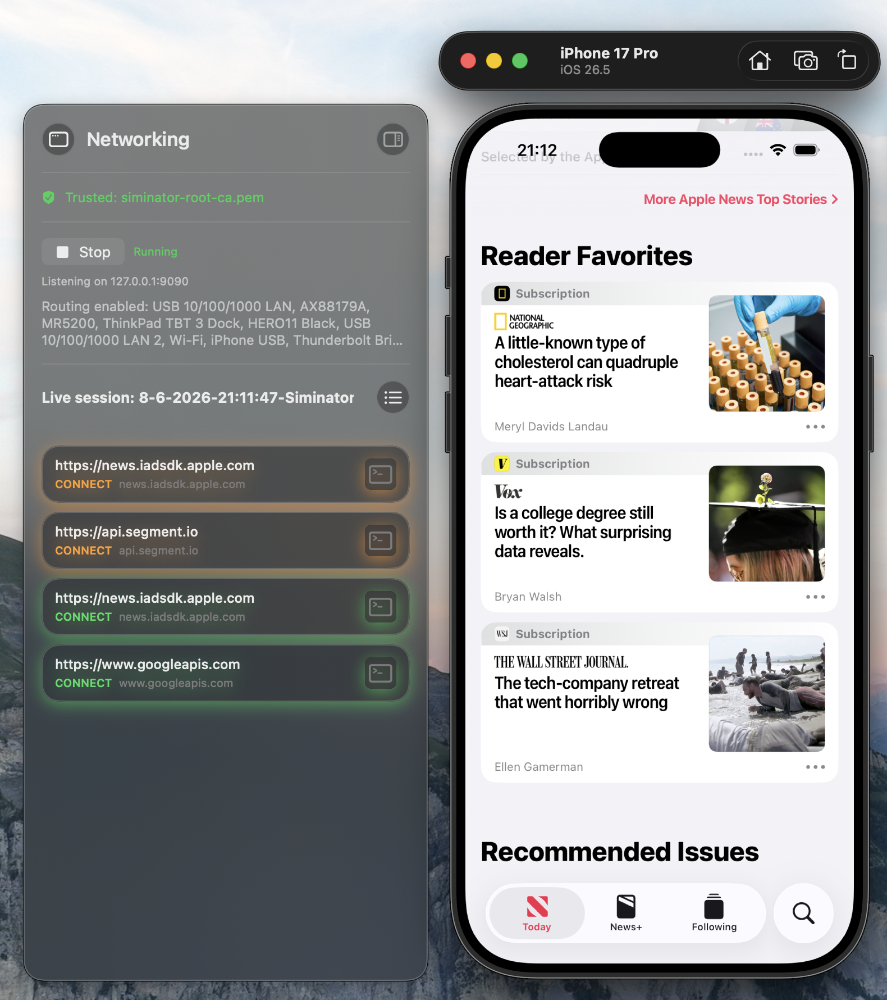

<p align="center">
  
</p>

<h1 align="center">Siminator</h1>

<p align="center">
  <strong>A macOS companion for iOS engineers — built around the Simulator.</strong>
</p>

<p align="center">
  <a href="LICENSE"></a>
  
  
</p>

---

## Overview

Siminator is an open-source macOS tool that lives alongside the iOS Simulator. It's a passion project and my attempt to get around never ending paywalls. 

The idea is simple: **one focused workspace for debugging, capturing, and shaping how your app behaves in the Simulator.**

<p align="center">
  
</p>

<p align="center"><em>Networking panel with live session capture, trusted MITM proxy, and request status at a glance.</em></p>

---

## What works today

| | |
|---|---|
| **Networking sidebar** | Docks to the Simulator window and captures HTTP/HTTPS traffic in real time |
| **App-scoped proxy** | Local proxy with certificate trust — inspect TLS without drowning in system-wide noise |
| **Session storage** | Record and browse captured requests per live session |
| **Simulator tracking** | Follows the Simulator window as you move or resize it |
| **Menu bar app** | Runs as a lightweight accessory app — stays out of your way until you need it |

---

## Roadmap

The vision is simple:

- [x] **Networking window** — Capture traffic from the Mac, singled out from specific apps running on any Simulator device. Supports map-local-style routing and session storage.
- [ ] **Pretty screen capturing** — Polished screenshots of the Simulator with clean framing and export-ready output.
- [ ] **Video capturing** — Screen recordings with animated movement tracking for demos and bug reports.
- [ ] **Customizable status bar** — Override the iPhone top bar: battery, network, time, and more.
- [ ] **Customizable network conditions** — Throttle, drop, or shape connectivity to match real-world scenarios.

---

## Getting started

### Requirements

- macOS (Apple Silicon or Intel)
- Xcode with iOS Simulator
- [Tuist](https://tuist.io) for project generation

### Build & run

```bash
git clone https://github.com/AtLab12/Siminator.git
cd Siminator
tuist install
tuist generate
open Siminator.xcworkspace
```


## Contributing

Issues and pull requests are welcome. If you are building toward something on the roadmap, open an issue first so we can align on direction.

---

## License

Siminator is licensed under the [GNU Affero General Public License v3.0](LICENSE).
